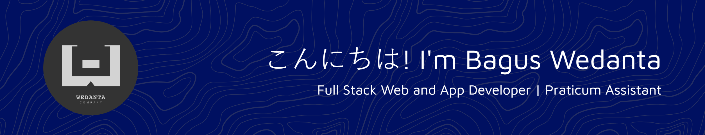

# 👺 Hi, Nice to See You

Hi, I'm Bagus Wedanta. I'm Front-End & Mobile Developer with experience building interactive and responsive using React, Typescript, and Flutter. Contribute to informative app projects, content-driven platforms, and intuitive navigation systems. Focused on optimal performance, accessibility, and user experience through clean and structured code. Always strive to deliver efficient, modern, and user-friendly software solutions.

 

# My Skills 💻📱📷

### Programming Languages

      
  

### Web and Mobile Development

              
  

### Databases

    

### DevOps & Tools

    

### Operating Systems

  

 

  
  
  

 

